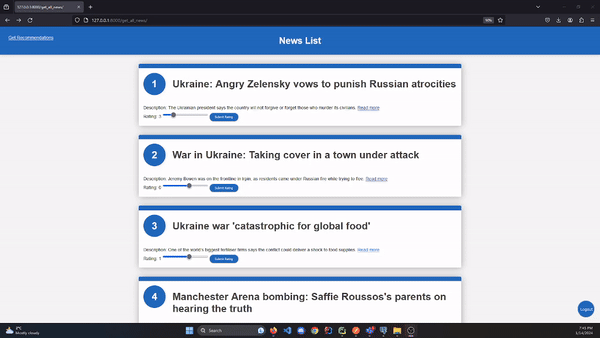

### News Recommendation

## Data

[Get Dataset (up to date)] https://www.kaggle.com/datasets/gpreda/bbc-news

I used a large dataset from BBC with 25,642 news articles to build a news recommendation app. I saved 1,000 articles in a PostgreSQL database for the app to work with. This approach ensures the app has a solid base for providing accurate recommendations.

## 
